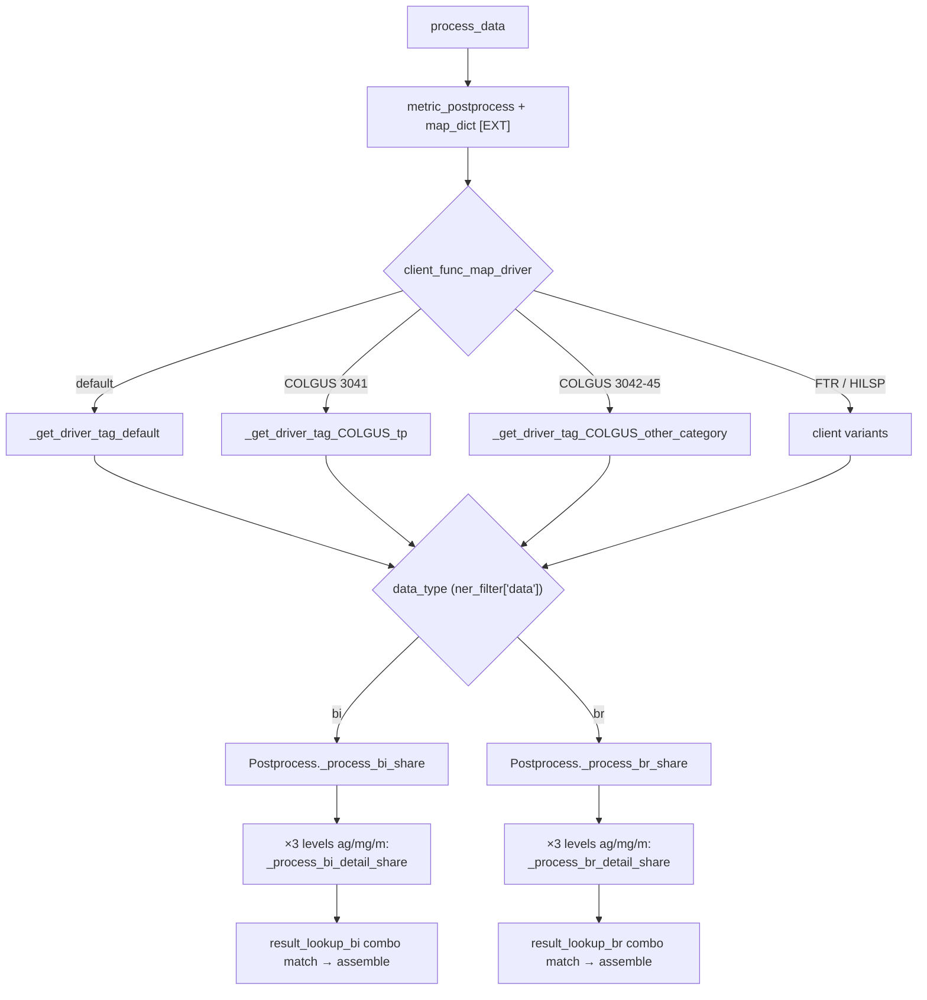
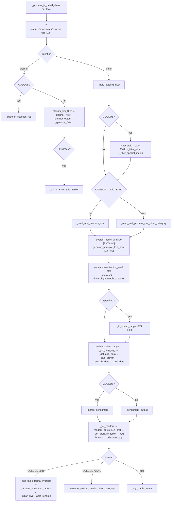
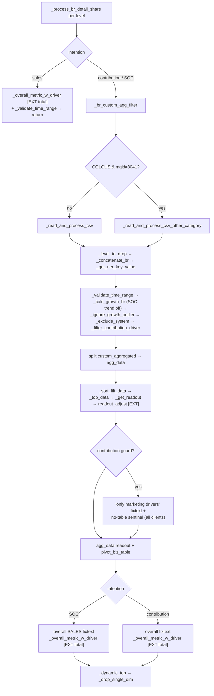

# process_data: BI / BR route reference

Scope: the live pipeline from `process_data` (readout.py:1941) down through `readout_utils`. Lines 24–1071 of readout.py are commented-out legacy per-client variants (`*_COLGUS_tp`, `*_COLGUS_other_category`, `*_FTR`, `*_HILSP`) and excluded. **[EXT]** marks an external dataset load from `$DATA_DIR/{CLIENT}/{MGID}/` via `get_data_path`; **[CLIENT]** marks hardcoded client/model-group branching.

## 1. Top-level routing

### `process_data(client_code, model_group_id, readout_data, process_indicator)` — readout.py:1941

1. `load_metric_postprocess` **[EXT: metric_postprocess.csv]**
2. `df_dict = {ag_df, mg_df, m_df}` from `ReadoutData` (BI/planner data loaded upstream, not here)
3. driver function = `client_func_map_driver[f"{client}_{mgid}"]` else `_get_driver_tag_default` → `driver_tags = (file_type, data_type, driver_high, driver_detail)`
4. `load_map_dict` **[EXT: map_dict]**; splits each intention's `sortMetric` on commas
5. `data_type == 'bi'` → `_process_bi`, else `_process_br`
6. `process_indicator` is accepted but **never used** on this path

### Function-mapping indirection — readout.py:1813–1938 + config/function_mapping.yaml

At import time the module writes `function_mapping.yaml` into env vars (`set_environment_variables`), then `json.loads(os.getenv(...))` + `resolve_function` builds five dicts: `client_func_map_bi`, `client_func_map_bi_detail`, `client_func_map_br`, `client_func_map_br_detail`, `client_func_map_driver`. `_process_bi` / `_process_br` (readout.py:1890/1913) resolve the function, detect Postprocess methods via `hasattr` + `__get__` binding, instantiate `Postprocess` and call it.

Key fact for comparison: **every bi/br entry in the yaml (COLGUS_3041..3045, FTR_1, HILSP_1, SCOTTS_1) maps to the same shared functions** (`Postprocess._process_bi_share`, `_process_bi_detail_share`, `Postprocess._process_br_share`, `_process_br_detail_share`), which are also the defaults. Only `client_func_map_driver` has real per-client variants. The bi/br maps are currently dead indirection.

### Driver-tag functions — readout_utils.py

| Function | Line | Behavior |
|---|---|---|
| `_get_driver_tag_default` | 368 | `data = ner_filter['data']`; bi → `("ag","bi","tactics","tactics")`, br → `("m","br","tactics","tactics")` |
| `_get_driver_tag_COLGUS_tp` | 223 | **[CLIENT]** routes on media_channel + core_dimension (mgid 3041) |
| `_get_driver_tag_COLGUS_other_category` | 267 | **[CLIENT]** product-focused variant (mgid 3042–3045) |
| `_get_driver_tag_FTR` | 320 | **[CLIENT]** FTR routing |
| `_get_driver_tag_HILSP` | 376 | **[CLIENT]** HILSP, supports `tactics_concat` |

Note: `_process_bi_share`/`_process_br_share` ignore the passed `driver_tags` and rebuild per-level tags from `tactics_level.csv` via `_generate_driver_tags` (readout_utils:3519). Only `data_type` from the driver function actually steers routing.

### `Postprocess.__init__` — readout.py:1446

State holder shared by both routes. Loads **[EXT ×5 files]**: `load_tactics_level`, `load_result_lookup_bi`, `load_result_lookup_br`, `load_agg_view_logic` (agg_view_setting.csv + agg_view_mapping.csv). Computes `driver_tags` / `driver_tags_br` per level (ag/mg/m) from tactics_level, builds `search_key` columns on both lookup tables (Y/N combo strings), filters `result_lookup_br` by `granular_level` flag. Initializes empty result fields (readout, detail_view, agg_view, benchmark, planner, pretext, ...).

## 2. BI route

Intentions: **planner**, **spending**, **margin roi**, **performance** (other metric intentions, e.g. response / cost per, take the generic branch — `_filter_paid_search` references them).

### 2.1 `_process_bi_detail_share` — readout.py:1073 (runs 3×, once per level ag/mg/m)

Returns 13-tuple: `(str_q, pivot_table, benchmark_data, benchmark_str, planner_table, spend_share_principle, fixtext, pivot_biz_table, pivot_sort_col, product_media_check, overall_ag_only, overall_table, principle_pretext)`.

**Setup (every call, every intention)** — readout.py:1077–1111:
loads `benchmark`, `planner`, `diminishing_returns` (dim_returns_curve + scenario_summary), `planner_filter`, `planner_principle`, `genome_principle` **[EXT ×7 files — ×3 levels = 21 reads/query, even when intention is not planner]**; resolves intention, trend/rank/how_many, sort metrics from map_dict, period_type, core_dimension(+composite), diag_tagging, level/tagging (`_get_level_tagging` **[CLIENT: LINKEDIN]**), Colgate-only fields (media_channel, product_halo).

**Branch A — intention == 'planner'** (readout.py:1113–1147):

| Step | COLGUS | Generic |
|---|---|---|
| Readout | `_planner_intention_res` (halo + media_channel aware) **[CLIENT]** | `planner_kpi_filter` → `_planner_filter` → `_planner_output` (fixtext, planner_table, reduce_budget, call_llm, head, spend_share_principle) |
| Principles | — | `_genome_fixtext` appended |
| LINKEDIN | — | forces `call_llm=True`, prefixes `'LINKEDIN no table readout. '` **[CLIENT]** |
| Assembly | — | call_llm: str_q=fixtext, fixtext=head+genome; else fixtext=head+fixtext+genome |

**Branch B — all other intentions** (readout.py:1148–1294), in order:

1. `curr_df = df_dict[file_type + '_df']` → `_halo_tagging_filter`; empty → `ValueError('No valid data.')` (caught by combiner, level marked empty)
2. `_get_dim_col_in_pivot_table_unique` **[CLIENT: LINKEDIN halo_level]**; `product_media_check` / `diagnostic_check` from `custom_aggregated` column
3. **[CLIENT: COLGUS]** `_filter_paid_search`; mgid 3041 also `_filter_pillar` + `_filter_special_media` (readout.py:1165–1169)
4. CSV processing: generic `_read_and_process_csv`; **[CLIENT: COLGUS mgid≠3041]** `_read_and_process_csv_other_category` (readout.py:1171–1174)
5. `_level_to_drop`; add `core_dimension_term` to dims; compute `uniq_dim` = max(product of multi-valued NER dims, distinct dim rows) — inline block readout.py:1178–1185
6. Overall fixtext (readout.py:1187–1200): if no core_dimension and `_custom_tagging_condition` and no composite/diag → `_overall_metric_w_driver` **[EXT: total, hidden]** + `convert_display_format`; blanked when `uniq_dim>=4`; sets `overall_ag_only=True`; drops custom_aggregated rows; **[CLIENT: COLGUS 3041]** drops special/non-media rows
7. `genome_principle_test_new` **[EXT ×3, hidden: genome_principle_client/_industry/_mapping]** → `principle_pretext`
8. Concatenate decision from tactics_level config (readout.py:1203–1210): `_concatenate_ag_mg_bi`; `driver_high = 'media_channel'` if COLGUS else `'tactics_concat'` **[CLIENT]**
9. `_get_ner_key_value`; empty → ValueError
10. intention == 'spending': `_bi_spend_range` **[EXT: total, hidden]** → appends ROI-Genome spend-range summary to principle_pretext (readout.py:1215–1219)
11. `_validate_time_range` → time warning prepended to fixtext
12. `_get_diag_agg` (diagnostic rows) → `_get_agg_data` (agg_view_logic split into agg vs detail + views)
13. `_calc_growth` (yoy/qoq/hoh/mom by period_type) → `_get_growth_sort_col` → `_sort_filt_data` → `_ignore_growth_outlier` (|growth|>1000 nulled) → `_top_data` → `_filter_top_media_channel`
14. Benchmark (readout.py:1240–1246): **[CLIENT: COLGUS]** `_merge_benchmark` (media-channel ROI index) else `_benchmark_output`
15. `_get_readout` → `readout_adjust` **[EXT: level_rename_display, hidden]** → `_get_granular_table` (pivot_table + pivot_sort_col)
16. agg_data branch (readout.py:1255–1273): growth/sort/outlier on agg → `pivot_biz_table`; readout: **[CLIENT: COLGUS]** product-media pivot via `_get_granular_level_pivot` with driver `tactics_detail`, else `_get_readout`; `str_q = str_q_agg + str_q`
17. `_readout_reformat` → `_dynamic_top` + `_drop_single_dim` on both pivots
18. Table format (readout.py:1281–1292): **[CLIENT: COLGUS 3041]** `_agg_table_format(...,'Product')` + `_rename_unwanted_tactics` ×2 + `_pillar_pivot_table_rename`; **[CLIENT: COLGUS >3041]** `_rename_product_media_other_category`; else `_agg_table_format`
19. diag_agg: drop 'Marketing Focus' column

### 2.2 `Postprocess._process_bi_share` — readout.py:1515 (combiner)

1. **Level loop** (1518–1540): run detail per ag/mg/m with per-level `driver_tags`; failures logged (`logger.warning`) and level filled with empties — log-and-continue
2. **Combo match** (1542–1555): `df_states` = Y/N over [ag.agg, ag.detail, mg.agg, mg.detail, m.agg, m.detail] + mg.all_custom_agg → join `'~'` → match `result_lookup_bi.search_key` (tie-break on all_custom_agg) → `result_combo_match` row dictates which level supplies readout/detail_view/agg_view/benchmark/planner/pretext/overall_view (`'detail_mg'`-style cell values, split on `'_'`)
3. `_get_readout_com` composes multi-level readout ("At Tactics level:" prefixes)
4. `overall_ag_only` + `readout_ag=='Y'` override (1582–1589): readout from ag only, agg/overall views cleared
5. `_add_na_term`, `_metrics_aka`
6. `dedup_post` detail-vs-agg, and vs overall_view if present **[CLIENT: HILSP/LINKEDIN special-cased inside]**
7. `_get_metrics_rename` ×3 views; `apply_level_mapping_display` ×3 **[EXT: level_rename_display, hidden, per call]**
8. `table_to_text` (token-budget truncation; prefers overall_view if present)
9. planner_readout override; `readout_adj` = `'LINKEDIN no table readout'` in readout (sentinel)
10. If `overall_ag_only` and rank=='na' and not readout_adj (1630–1653): `load_prompt_instruction` **[EXT]** → per-intention extra instruction + `_bi_custom_instruction` (trend/outlier text) + `_get_pretext_overall_trend` **[EXT: total, hidden]** → readout = instruction + custom + readout
11. else: `_table_readout_prompt` (instructs LLM to analyze agg+detail tables); sentinel branch strips marker
12. spending: prepend passive-tense instruction (1658–1660)
13. `_table_month_transform` ×3, `_rename_change_columns` ×3, `result_combo_match['is_specific']`
14. Returns 14-tuple → becomes `ReadoutData` fields downstream (`context_str`, `data`, `benchmark_*`, `planner_data`, `pretext`, `pivot_biz_table`, `principle_pretext`, `overall_view`, `readout_adj`)

## 3. BR route

Intentions: **sales**, **contribution**, **source of change**.

### 3.1 `_process_br_detail_share` — readout.py:1299 (runs 3×, per level)

Returns 9-tuple: `(str_q, pivot_table, benchmark_data="", benchmark_str="", planner_table=empty, fixtext, pivot_biz_table, pivot_sort_col, overall_table)` — benchmark/planner are always empty for BR.

**Branch A — intention == 'sales'** (1320–1326): `_overall_metric_w_driver` **[EXT: total, hidden]** with `dim_dict=None` → (str_q, pivot_table); `_validate_time_range`. Done.

**Branch B — contribution / source of change** (1327–1439), in order:

1. `_br_custom_agg_filter` (drops custom_aggregated=='yes' unless halo/core_dimension); empty → ValueError
2. CSV processing: same COLGUS-other-category split as BI (1334–1337) **[CLIENT]**
3. `_level_to_drop`; core_dimension_term; `_concatenate_br` (driver concat); `_get_ner_key_value`, `ner_dict['driver']=driver_detail`; empty → ValueError
4. `_validate_time_range`; `_calc_growth_br` (SOC: trend_check forced 'no' at 1305; filters to latest 'end' period); `_get_growth_sort_col`; `_ignore_growth_outlier`
5. `_exclude_system` (drops business_driver=='system' except SOC); `_filter_contribution_driver` (contribution → keep media/marketing/promotions/non-media, returns `trigger_pretext`)
6. Split `custom_aggregated=='yes'` into `agg_data` (1358–1362)
7. main data: `_sort_filt_data` → `_top_data` → `_get_readout`
8. Contribution guard (1372–1374): if (trigger_pretext and no core_dimension) or data empty or base/other requested → fixtext += "We only provide contribution by marketing drivers. ", trigger_pretext=True
9. `readout_adjust` **[EXT: level_rename_display, hidden]**
10. agg_data branch (1381–1399): driver forced `tactics_detail`, own readout + `readout_adjust` + `pivot_biz_table`; `str_q = str_q_agg + str_q`
11. trigger_pretext → prefix `'LINKEDIN no table readout. '` **(generic sentinel, all clients — misleading name)** (1400–1401)
12. `_get_granular_table` → pivot_table
13. `uniq_dim` inline computation (1407–1413, duplicate of BI block)
14. SOC (1414–1425): overall **sales** fixtext — copy ner_filter, set main_metric to sales metrics from metric_df, `_overall_metric_w_driver` **[EXT: total]**, append if uniq_dim<4
15. contribution (1427–1434): if no core_dimension and custom tagging → overall fixtext via `_overall_metric_w_driver` **[EXT: total]**, append if uniq_dim<4
16. `_dynamic_top` (rank-aware) + `_drop_single_dim` on both pivots

### 3.2 `Postprocess._process_br_share` — readout.py:1672 (combiner)

1. Level loop with log-and-continue (1675–1690), per-level `driver_tags_br`
2. Combo match (1692–1726): key over 4 states [ag.detail, mg.agg, mg.detail, m.detail] (+all_custom_agg) when lookup has `agg_mg` column, else 3 states [ag.detail, mg.detail, m.detail] → match `result_lookup_br` → select readout/detail_view/agg_view/pretext/pivot_sort_col/pretext_table; benchmark/planner forced empty
3. `_add_na_term`, `_metrics_aka`
4. `dedup_post(type='br')` only when 'Tactics' in detail columns; restore agg_view if dedup shrank it (1730–1737)
5. `_get_metrics_rename` ×2; `_br_table_reformat`; if detail==agg → drop agg, re-derive readout from detail level (1744–1749)
6. `biz_driver_check` from ag.detail Business_Driver values (1750–1756)
7. `apply_level_mapping_display` ×2 **[EXT: level_rename_display, hidden]**; `table_to_text`
8. Sentinel check; if no base/other and no core_dimension and rank na (1768–1791): SOC/sales → `_table_readout_prompt`; contribution → `_get_pretext_overall_trend(driver_col='Business Driver')` **[EXT: total, hidden]**; `load_prompt_instruction` **[EXT]** + `_br_custom_instruction` → readout assembly (near copy of BI block 1631–1653)
9. else `_table_readout_prompt` / strip sentinel
10. contribution + base/other present in raw dfs → prepend "Base Drivers" explainer paragraph (1796–1804)
11. Column renames, month transforms, `is_specific` flag; returns same 14-tuple shape as BI (principle_pretext='', overall_view=empty)

## 4. Per-function reference

Grouped by role. Line numbers are readout_utils.py unless noted. "Client?" = takes client_code/mgid AND branches on it (vs just passing through to loaders).

### 4.1 Data loaders (all uncached, all `get_data_path` → local disk)

| Function | Line | File(s) | Notes |
|---|---|---|---|
| `load_metric_postprocess` | 84 | metric_postprocess.csv | metric naming/format/sort config |
| `load_map_dict` | 77 | map_dict | per-intention rankMetric/sortMetric |
| `load_tactics_level` | 116 | tactics_level.csv | per-level file/driver/concat config |
| `load_result_lookup_bi` | 91 | result_lookup_bi.csv | combo → readout/view selection |
| `load_result_lookup_br` | 97 | result_lookup_br.csv | same for BR, optional granular_level/agg_mg cols |
| `load_agg_view_logic` | 104 | agg_view_setting.csv + agg_view_mapping.csv | agg/detail split + display renames |
| `load_benchmark_data` | 123 | benchmark | renames channel→media_channel, benchmarkIndex |
| `load_planner_data` | 63 | planner | scenario outputs |
| `load_diminishing_returns_data` | 70 | dim_returns_curve + scenario_summary | 2 files |
| `load_planner_filter` | 134 | planner_filter.csv | scenario dimension filter |
| `load_planner_principle` | 152 | planner_principle.csv | |
| `load_genome_principle` | 160 | genome_principle.csv | |
| `load_genome_principle_client/_industry/_mapping` | 5350/5358/5366 | 3 files | used only by `genome_principle_test_new` |
| `load_prompt_instruction` | 143 | prompt_instruction.csv | per-intention LLM instruction |
| `load_level_rename_display` | 177 | level_rename_display.csv | display renames; loaded repeatedly (hidden) |
| `load_total_data` | 59 | total | overall metrics source; loaded at 4 hidden call sites (2437, 2485, 4049, 4852) |

### 4.2 Data prep / filtering

| Function | Line | Role | Client? |
|---|---|---|---|
| `_halo_tagging_filter` | 3438 | filter rows by halo tags + custom_aggregated | no |
| `_get_level_tagging` | 3412 | (level, tagging) from ner_filter | **LINKEDIN** adds halo_tag (3417) |
| `_custom_tagging_condition` | 3424 | False if any tagging field populated | no |
| `_read_and_process_csv` | 461 | rename cols, convert time, drop NaNs | no |
| `_read_and_process_csv_other_category` | 488 | + product/category dims, product_focused_media | no (selected by COLGUS caller) |
| `_level_to_drop` | 3431 | drop dim cols not in level filter | no |
| `_get_dim_col_in_pivot_table` | 2294 | dim cols from df_dict | no |
| `_get_dim_col_in_pivot_table_unique` | 2308 | unique dim cols | **LINKEDIN** halo_level via `_get_dimension_cols_unique` (562) |
| `_concatenate_ag_mg_bi` | 530 | tactics + detail → tactics_concat | no |
| `_concatenate_br` | 542 | conditional driver concat for BR | no |
| `_get_ner_key_value` | 576 | ner_dict (dimension/time/metric/driver/value/period) | no |
| `_filter_paid_search` | 1769 | drop paid search for response/cost-per intentions | COLGUS-only caller |
| `_filter_pillar` | 1776 | drop custom_aggregated=='p' rows | COLGUS-3041-only caller |
| `_filter_special_media` | 1783 | drop special media unless 'ahw' halo | COLGUS-3041-only caller |
| `_br_custom_agg_filter` | 3544 | drop custom_aggregated=='yes' unless halo/core_dim | no |
| `_exclude_system` | 2806 | drop business_driver=='system' except SOC | no |
| `_filter_contribution_driver` | 2785 | contribution → marketing drivers only | no |
| `_get_diag_agg` | 2150 | diagnostic rows when file_type=='mg' | no |
| `_get_agg_data` | 2158 | agg_view_logic-driven agg/detail split | no (config-driven) |

### 4.3 Growth / sort / top

| Function | Line | Role |
|---|---|---|
| `_calc_growth` | 1826 | dispatch yoy/qoq/hoh/mom by period_type (helpers 622–890) |
| `_calc_growth_br` | 2793 | BR variant; SOC keeps latest 'end'; appends business_driver dim |
| `_get_growth_sort_col` | 1838 | (growth_col, sort_by_col) |
| `_sort_filt_data` | 891 | rank tactics/drivers per dim group by metric |
| `_ignore_growth_outlier` | 1847 | null growth where abs > 1000 |
| `_top_data` | 1207 | top-N (default 3) per group |
| `_filter_top_media_channel` | 1927 | extra top filter when driver_high=='media_channel' |

### 4.4 Readout (text) generation

| Function | Line | Role | Client? |
|---|---|---|---|
| `_get_readout` | 1956 | core readout: totals + top increase/decrease per metric verbiage | no |
| `readout_adjust` | 5285 | level_rename_display remap + readout recompute | **[EXT lrd]**; LINKEDIN marker at 5328 |
| `_get_readout_com` | 2003 | compose multi-level readouts ("At Tactics level:" / "More granularly:") | no |
| `_overall_metric_w_driver` | 2557 | overall metric text + driver breakdown table | **[EXT total]**; mgid 3042–3045 → `_overall_metric_other_category` (2442/2491) |
| `_get_pretext_overall_trend` | 2602 | overall trend pretext + trend pivot | **[EXT total]** via `_recent_roi_spend` (4048) |
| `_bi_spend_range` | 4851 | ROI-Genome spend-range vs forecast share | **[EXT total]** |
| `genome_principle_test_new` | 5882 | principle alignment text vs client/industry ROI | **[EXT ×3 genome files]** |
| `_genome_fixtext` | 4812 | filter+join genome principle sentences | no |
| `_bi_custom_instruction` | 3666 | BI trend/outlier custom LLM instruction | takes client_code (passes through) |
| `_br_custom_instruction` | 3622 | BR contribution/SOC instruction | no |
| `_table_readout_prompt` | 3553 | "analyze agg+detail tables" wrapper | no |
| `_validate_time_range` | 4736 | out-of-range / YTD warnings | no |
| `_add_na_term` / `_metrics_aka` | 2039/1941 | n/a-term note; metric alias substitution | no |
| `_readout_reformat` | 2121 | lookup-driven readout text fixes | no |
| `convert_display_format` | 1747 | number → $X.XM display | no |

### 4.5 Table (pivot) construction & display

| Function | Line | Role | Client? |
|---|---|---|---|
| `_get_granular_table` | 945 | pivot via `_table_display` (999: time order, %, $, title case) | client_code param for sort only |
| `_dynamic_top` | 2323 | cap rows (default 20), SOC abs-value sort | no |
| `_drop_single_dim` | 2210 | drop all-'Overall' dim cols | no |
| `_agg_table_format` | 2253 | agg_view_mapping renames + ordering | no (config-driven) |
| `_rename_unwanted_tactics` | 2220 | regex-rename generic tactic names | COLGUS-3041-only caller |
| `_pillar_pivot_table_rename` | 2359 | Tactics → 'Product Media Overall' | COLGUS-3041-only caller |
| `_rename_product_media_other_category` | 2074 | Product→Channel / dim→'Product Media' | COLGUS-3042+-only caller |
| `dedup_post` | 4902 | remove detail rows duplicated in agg view | **HILSP/LINKEDIN** branch (4903) |
| `_get_metrics_rename` | 2047 | metric col → display name from metric_df | no |
| `apply_level_mapping_display` | 5063 | level_rename_display col/value renames + sort | **[EXT lrd]** |
| `_br_table_reformat` | 2831 | BR detail/agg table cleanup | no |
| `table_to_text` | 3351 | df → text with token truncation; SOC pos/neg split (`_soc_split_table` 3336) | no |
| `_table_month_transform` | 3567 | "Month N" → month names | no |
| `_rename_change_columns` | 1200 | change-col display rename | no |

### 4.6 Planner-specific (BI planner intention)

| Function | Line | Role |
|---|---|---|
| `planner_kpi_filter` | 5037 | scenario selection by KPI (uses `select_scenarios_by_kpi` 4984) |
| `_planner_filter` | 3461 | scenario filter by dimension values |
| `_planner_output` | 3135 | full planner narrative: curves (`_planner_curve` 2876), open statement (2905), driver fixtext (`_build_planner_fixtext_and_table` 3107), spend range (`_planner_spend_range` 3049), reduce-budget (3094) |
| `_planner_intention_res` | 2377 | COLGUS planner readout (halo/media-channel hardcoded) |

### 4.7 Benchmark

| Function | Line | Role | Client? |
|---|---|---|---|
| `_benchmark_output` | 1398 | generic benchmark text+table (`_benchmark_data` 1410, `_benchmark_to_text` 1461, `_benchmark_table_display` 1491, `_calc_roi_index` 1386) | no |
| `_merge_benchmark` | 1879 | media-channel ROI-index merge for margin roi/performance | COLGUS-only caller |

### 4.8 Combiner support

| Function | Line | Role |
|---|---|---|
| `_generate_driver_tags` | 3519 | tactics_level.csv → per-level (file_type, dataType, driver) tags |
| `_get_readout_com` | 2003 | see 4.4 |
| `_check_key_or_value` | 201 | recursive core_dimension search |

## 5. External dataset load inventory (per query)

| Where | Files | Reads/query |
|---|---|---|
| `process_data` | metric_postprocess, map_dict | 2 |
| `Postprocess.__init__` | tactics_level, result_lookup_bi, result_lookup_br, agg_view ×2 | 5 |
| `_process_bi_detail_share` setup | benchmark, planner, DR ×2, planner_filter, planner_principle, genome_principle | **21 (7×3 levels, any intention)** |
| `genome_principle_test_new` | genome_principle_client/_industry/_mapping | up to 9 (3×3) |
| `_overall_metric_w_driver`, `_bi_spend_range`, `_recent_roi_spend` | total | 1 per call, ≤4 sites, hidden |
| `readout_adjust`, `apply_level_mapping_display` | level_rename_display | 1 per call, ≥6, hidden |
| `_process_bi_share` / `_process_br_share` | prompt_instruction | 0–1 |

No loader is cached (no lru_cache, no st.cache). BI/BR/planner raw dataframes themselves come in via `ReadoutData` (loaded before `process_data`).

## 6. Client-specific logic inventory

Hardcoded in live readout.py:

| Condition | Lines | Effect |
|---|---|---|
| `== 'COLGUS'` | 1114, 1165, 1240, 1208, 1263 | planner readout fn; paid-search filter; `_merge_benchmark`; driver_high='media_channel'; pillar agg readout |
| `COLGUS and mgid == 3041` | 1167–1169, 1199–1200, 1281–1287 | pillar/special-media filters; row drops; Product table format + renames |
| `COLGUS and mgid != 3041` | 1171, 1334 | other-category CSV read (BI + BR) |
| `COLGUS and mgid > 3041` | 1288 | product-media column rename |
| `== 'LINKEDIN'` | 1138 | planner forces call_llm + sentinel |
| sentinel string | 1401, 1629, 1767 | `'LINKEDIN no table readout. '` used as generic no-table flag for all clients |

Hardcoded in readout_utils.py: `_get_level_tagging` 3417 (LINKEDIN), `_get_dimension_cols_unique` 562 (LINKEDIN), `dedup_post` 4903 (HILSP, LINKEDIN), `_overall_metric` 2442 / `_prepare_overall_driver_data` 2491 (mgid 3042–3045), `readout_adjust` 5328 (sentinel), driver-tag variants 223/267/320/376.

Config-driven (correct pattern, per-client data files): function_mapping.yaml, tactics_level, result_lookup_bi/br, agg_view_setting/mapping, map_dict, metric_postprocess, prompt_instruction, level_rename_display, benchmark, planner files.

## 7. Improvement suggestions (ranked, with risk)

1. **Cache / hoist loaders** — low risk, biggest win. Add `functools.lru_cache(maxsize=None)` keyed on (client_code, model_group_id) to the `load_*` functions, or move the 7 planner/benchmark/principle loads from `_process_bi_detail_share` into `Postprocess.__init__` (the pattern tactics_level already uses) and pass them down. Eliminates ~40 redundant disk reads per query. Caveat for Streamlit: cache invalidation when data files refresh — `lru_cache` per process is fine if data is deploy-static, otherwise `st.cache_data` with TTL on the entry points.
2. **Name the sentinel** — trivial. `NO_TABLE_READOUT_MARKER = 'LINKEDIN no table readout. '` module constant; it is client-agnostic in BR (readout.py:1401) and grepping for behavior currently requires knowing the LINKEDIN string.
3. **Extract shared combiner finisher** — medium risk. `_process_bi_share` and `_process_br_share` duplicate: combo-match → view selection → `_add_na_term`/`_metrics_aka` → dedup → `_get_metrics_rename` → `apply_level_mapping_display` → `table_to_text` → prompt-instruction assembly (1631–1653 ≈ 1778–1791) → month transform/col rename. A `_finalize_views(...)` + `_assemble_instruction_readout(...)` pair would halve both methods and guarantee BI/BR display parity.
4. **Move inline COLGUS branches behind dispatch** — medium-high risk, do per-branch. The `client_func_map_*` mechanism exists precisely for this but all entries point at the shared functions while COLGUS logic leaks inline. Options: a) small strategy hooks (e.g. `pre_filter_hook`, `benchmark_fn`, `table_format_fn`) resolved from function_mapping.yaml; b) flags on `ProcessIndicator` (already a parameter of `process_data`, currently unused here). Candidates in order of isolation: benchmark merge (1240), table format (1281), paid-search/pillar filters (1165), other-category read (1171).
5. **Merge `*_other_category` twins** — `_read_and_process_csv` vs `_read_and_process_csv_other_category` (461/488) and `_overall_metric` vs `_overall_metric_other_category` (2432/2410) differ in product-dimension handling; a `product_dims: list` parameter collapses each pair.
6. **Extract `uniq_dim` helper** — duplicated verbatim at readout.py:1178–1185 and 1407–1413.
7. **Drop the env-var round-trip for function mapping** — `set_environment_variables` + `json.loads(os.getenv(...))` at import time (readout.py:1840–1867) could read the yaml dict directly; env indirection adds an import-order trap and makes the mapping invisible to grep.
8. **Config-drive `dedup_post` gate** — replace `client_code in ['HILSP','LINKEDIN']` (4903) with a flag (level_rename_display column or ProcessIndicator).
9. **Replace `ValueError('No valid data.')` control flow** — empties are signaled by exception and caught as warnings in the combiner; a sentinel return (empty result dict) would distinguish "no data" from genuine bugs in the logs.

Per project convention: items 3–9 touch `src/model/*` (intentionally loose zone, review required outside it); stage them separately and do not reformat adjacent legacy blocks.

## 8. Cross-repo comparison checklist

When diffing against the other repo, compare in this order:

a) `config/function_mapping.yaml` — which client keys exist, whether bi/br maps diverge from the shared defaults
b) Driver-tag functions (readout_utils 223–414) — routing semantics per client
c) `_process_bi_detail_share` / `_process_br_detail_share` step lists (sections 2.1 / 3.1) — step presence and order
d) Combiner combo-match logic and `result_lookup_bi/br` schemas (search_key construction readout.py:1486–1493)
e) The 14-tuple return contract of `_process_bi_share`/`_process_br_share` (consumed by `ReadoutData`/st-main)
f) Loader list (section 4.1) — file inventory differences imply data-contract differences
g) Client literals (section 6) — which hardcoded branches the other repo has resolved or added
